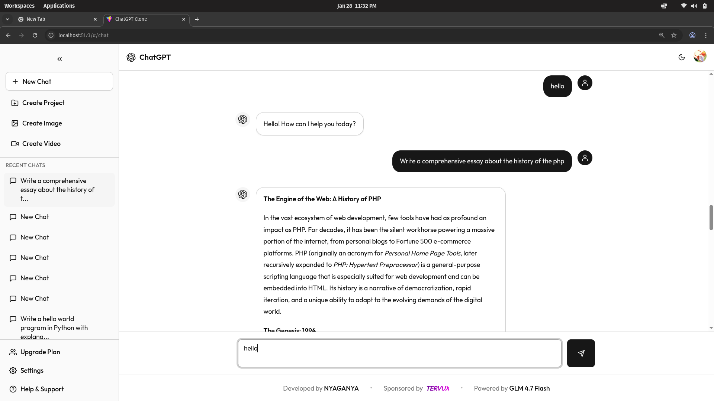
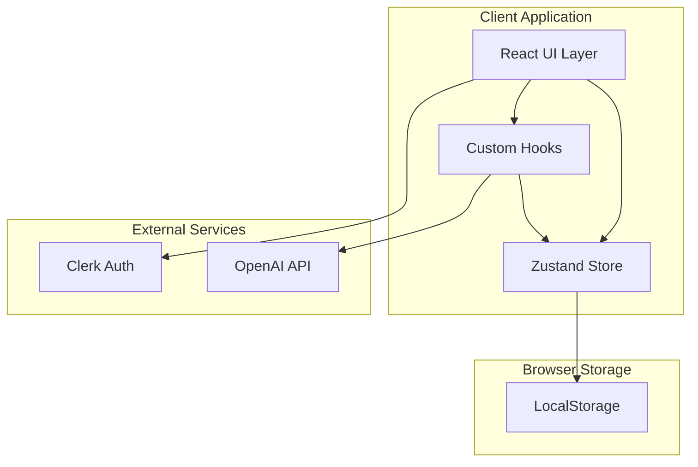
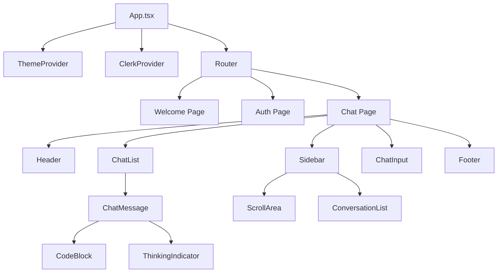
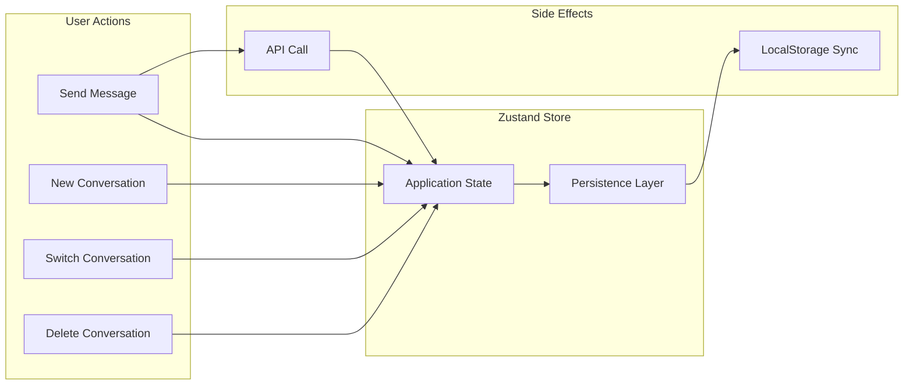

# ChatGPT Clone

A production-ready, full-stack AI chat application built with modern web technologies. This project demonstrates advanced frontend development skills, state management patterns, API integration, and responsive UI/UX design principles.



---

## Table of Contents

- [Overview](#overview)
- [Problem Statement](#problem-statement)
- [Solution](#solution)
- [Key Features](#key-features)
- [Technology Stack](#technology-stack)
- [Architecture](#architecture)
- [Project Structure](#project-structure)
- [Getting Started](#getting-started)
- [Environment Variables](#environment-variables)
- [Usage](#usage)
- [Technical Highlights](#technical-highlights)
- [Performance Optimizations](#performance-optimizations)
- [Security Considerations](#security-considerations)
- [Future Enhancements](#future-enhancements)
- [License](#license)

---

## Overview

This ChatGPT Clone is a sophisticated web application that replicates the core functionality and user experience of OpenAI's ChatGPT interface. Built from the ground up with React 19, TypeScript, and Tailwind CSS v4, the application showcases modern frontend architecture patterns and best practices.

The project serves as a comprehensive demonstration of:
- Building production-grade React applications
- Implementing real-time AI chat functionality
- Creating responsive, accessible user interfaces
- Managing complex application state
- Integrating third-party authentication and AI services

---

## Problem Statement

Organizations and individuals seeking to leverage AI chat capabilities face several challenges:

1. **Cost Barriers**: Enterprise AI solutions often come with significant licensing fees
2. **Customization Limitations**: Off-the-shelf products lack flexibility for branding and feature customization
3. **Data Privacy Concerns**: Third-party platforms may not meet specific data handling requirements
4. **Integration Complexity**: Existing solutions may not integrate well with current infrastructure

Developers building AI-powered applications also encounter:
- Complex state management for real-time chat interfaces
- Challenges in creating responsive, accessible UIs
- Authentication and security implementation overhead
- Streaming response handling and rendering

---

## Solution

This ChatGPT Clone addresses these challenges by providing:

| Challenge | Solution |
|-----------|----------|
| Cost Barriers | Open-source codebase with bring-your-own-API-key model |
| Customization | Fully customizable React components with Tailwind CSS |
| Data Privacy | Self-hosted option with full control over data flow |
| Integration | Modular architecture designed for easy extension |
| State Management | Zustand-based store with persistent conversations |
| Real-time UI | Streaming API integration with dynamic loading states |
| Authentication | Clerk integration for secure, production-ready auth |

---

## Key Features

### Core Functionality
- **AI-Powered Conversations**: Real-time chat with OpenAI-compatible APIs
- **Multi-Conversation Management**: Create, switch, and delete multiple chat threads
- **Persistent Storage**: Conversations saved locally with automatic state restoration
- **Markdown Rendering**: Full markdown support including code blocks with syntax highlighting

### User Interface
- **Collapsible Sidebar**: Space-efficient navigation with smooth animations
- **Dark/Light Theme**: System-aware theming with manual toggle
- **Responsive Design**: Optimized for mobile, tablet, and desktop viewports
- **Dynamic Loading Indicators**: Engaging feedback during AI response generation

### Authentication and Security
- **Clerk Authentication**: Secure sign-in/sign-up with multiple providers
- **Protected Routes**: Route-level access control
- **Session Management**: Automatic token refresh and session handling

### Developer Experience
- **TypeScript**: Full type safety across the codebase
- **Component Architecture**: Reusable, composable UI components
- **Modern Tooling**: Vite for fast development and optimized builds

---

## Technology Stack

### Frontend Framework
| Technology | Version | Purpose |
|------------|---------|---------|
| React | 19.2.0 | UI library with concurrent features |
| TypeScript | 5.9.3 | Static type checking |
| Vite | 7.2.4 | Build tool and dev server |

### Styling and UI
| Technology | Version | Purpose |
|------------|---------|---------|
| Tailwind CSS | 4.1.18 | Utility-first styling |
| Framer Motion | 12.29.2 | Animations and transitions |
| Radix UI | Latest | Accessible component primitives |
| Lucide React | 0.563.0 | Icon library |

### State and Data
| Technology | Version | Purpose |
|------------|---------|---------|
| Zustand | 5.0.10 | Lightweight state management |
| OpenAI SDK | 6.16.0 | AI API integration |

### Authentication
| Technology | Version | Purpose |
|------------|---------|---------|
| Clerk | 5.59.6 | Authentication and user management |

### Content Rendering
| Technology | Version | Purpose |
|------------|---------|---------|
| React Markdown | 10.1.0 | Markdown parsing and rendering |
| Highlight.js | 11.11.1 | Code syntax highlighting |
| Rehype Highlight | 7.0.2 | Markdown code block highlighting |

---

## Architecture

### System Overview



### Component Hierarchy



### State Management Flow



---

## Project Structure

```
chatgpt-clone/
├── public/                    # Static assets
├── src/
│   ├── components/           # React components
│   │   ├── ui/              # Base UI components (Button, ScrollArea)
│   │   ├── ChatInput.tsx    # Message input component
│   │   ├── ChatList.tsx     # Message list container
│   │   ├── ChatMessage.tsx  # Individual message display
│   │   ├── CodeBlock.tsx    # Syntax-highlighted code blocks
│   │   ├── Footer.tsx       # Application footer
│   │   ├── Header.tsx       # Application header with navigation
│   │   ├── Sidebar.tsx      # Collapsible sidebar with conversations
│   │   ├── ThinkingIndicator.tsx  # AI loading animation
│   │   └── theme-provider.tsx     # Theme context provider
│   ├── hooks/               # Custom React hooks
│   │   └── useChat.ts       # Chat functionality hook
│   ├── lib/                 # Utility libraries
│   │   ├── openai.ts        # OpenAI API configuration
│   │   ├── store.ts         # Zustand state store
│   │   └── utils.ts         # Utility functions
│   ├── pages/               # Page components
│   │   ├── Auth.tsx         # Authentication page
│   │   ├── Chat.tsx         # Main chat interface
│   │   ├── NotImplemented.tsx # Placeholder page
│   │   └── Welcome.tsx      # Landing page
│   ├── App.tsx              # Application root
│   ├── index.css            # Global styles
│   └── main.tsx             # Entry point
├── .env                     # Environment variables (not committed)
├── package.json             # Dependencies and scripts
├── tailwind.config.ts       # Tailwind configuration
├── tsconfig.json            # TypeScript configuration
└── vite.config.ts           # Vite configuration
```

---

## Getting Started

### Prerequisites

- Node.js 18.0 or higher
- npm or yarn package manager
- Clerk account for authentication
- OpenAI API key or compatible endpoint

### Installation

1. **Clone the repository**
   ```bash
   git clone https://github.com/JonniTech/ChatGPT-Clone.git
   cd ChatGPT-Clone
   ```

2. **Install dependencies**
   ```bash
   npm install
   ```

3. **Configure environment variables**
   ```bash
   cp .env.example .env
   ```
   Edit `.env` with your credentials (see Environment Variables section)

4. **Start the development server**
   ```bash
   npm run dev
   ```

5. **Open in browser**
   Navigate to `http://localhost:5173`

### Build for Production

```bash
npm run build
npm run preview
```

---

## Environment Variables

| Variable | Description | Required |
|----------|-------------|----------|
| `VITE_CLERK_PUBLISHABLE_KEY` | Clerk publishable key for authentication | Yes |
| `VITE_ZAI_API_KEY` | z.ai API key for AI chat functionality | Yes |

Example `.env` file:
```env
VITE_CLERK_PUBLISHABLE_KEY=pk_test_your_clerk_key
VITE_ZAI_API_KEY=your_zai_api_key
```

---

## Usage

### Starting a Conversation
1. Sign in using Clerk authentication
2. Click "New Chat" or "Start Chatting" button
3. Type your message in the input field
4. Press Enter or click the send button

### Managing Conversations
- **View History**: All conversations appear in the sidebar
- **Switch Conversations**: Click any conversation to resume
- **Delete Conversations**: Hover and click the trash icon
- **Collapse Sidebar**: Click the chevron to maximize chat space

### Theme Switching
- Click the sun/moon icon in the header to toggle themes
- Theme preference is automatically saved

---

## Technical Highlights

### Real-time Streaming Responses
The application implements streaming API responses for a responsive user experience:
```typescript
// Streaming implementation in useChat hook
const stream = await openai.chat.completions.create({
  model: 'gpt-4',
  messages: conversationHistory,
  stream: true,
});

for await (const chunk of stream) {
  // Update UI incrementally as tokens arrive
}
```

### Persistent State Management
Zustand with persistence middleware ensures conversations survive page refreshes:
```typescript
export const useChatStore = create<ChatStore>()(
  persist(
    (set, get) => ({
      conversations: [],
      activeConversationId: null,
      // ... actions
    }),
    { name: 'chat-store' }
  )
);
```

### Dynamic Loading States
The ThinkingIndicator component provides engaging feedback:
```typescript
const loadingMessages = [
  "Understanding your question...",
  "Analyzing context...",
  "Formulating response...",
  // Cycles through messages with animations
];
```

### Responsive Sidebar
The sidebar implements different behaviors for mobile and desktop:
- Mobile: Slide-out overlay with backdrop
- Desktop: Collapsible with width transition (64px to 256px)

---

## Performance Optimizations

1. **Code Splitting**: Vite automatically splits code for optimal loading
2. **Lazy Loading**: Components loaded on-demand where appropriate
3. **Memoization**: React.memo and useMemo prevent unnecessary re-renders
4. **Efficient State Updates**: Zustand's atomic updates minimize component updates
5. **CSS-in-JS Avoidance**: Tailwind CSS compiles to static CSS for better performance

---

## Security Considerations

1. **Authentication**: All routes protected by Clerk authentication
2. **API Key Protection**: Keys stored in environment variables, not committed
3. **XSS Prevention**: React's built-in escaping and careful markdown rendering
4. **HTTPS**: Recommended for production deployment
5. **Content Security Policy**: Compatible with strict CSP headers

---

## Future Enhancements

- [ ] Voice input and text-to-speech output
- [ ] Image generation integration (DALL-E)
- [ ] File upload and document analysis
- [ ] Conversation sharing and export
- [ ] Custom system prompts and personas
- [ ] Multi-language support
- [ ] Plugin system for extensibility
- [ ] Collaborative conversations

---

## Scripts Reference

| Command | Description |
|---------|-------------|
| `npm run dev` | Start development server |
| `npm run build` | Build for production |
| `npm run preview` | Preview production build |
| `npm run lint` | Run ESLint |

---

## License

This project is open source and available under the MIT License.

---

## Contact

For questions, suggestions, or collaboration opportunities, please reach out through GitHub issues or pull requests.

---

**Built with modern web technologies to demonstrate production-ready development practices.**
